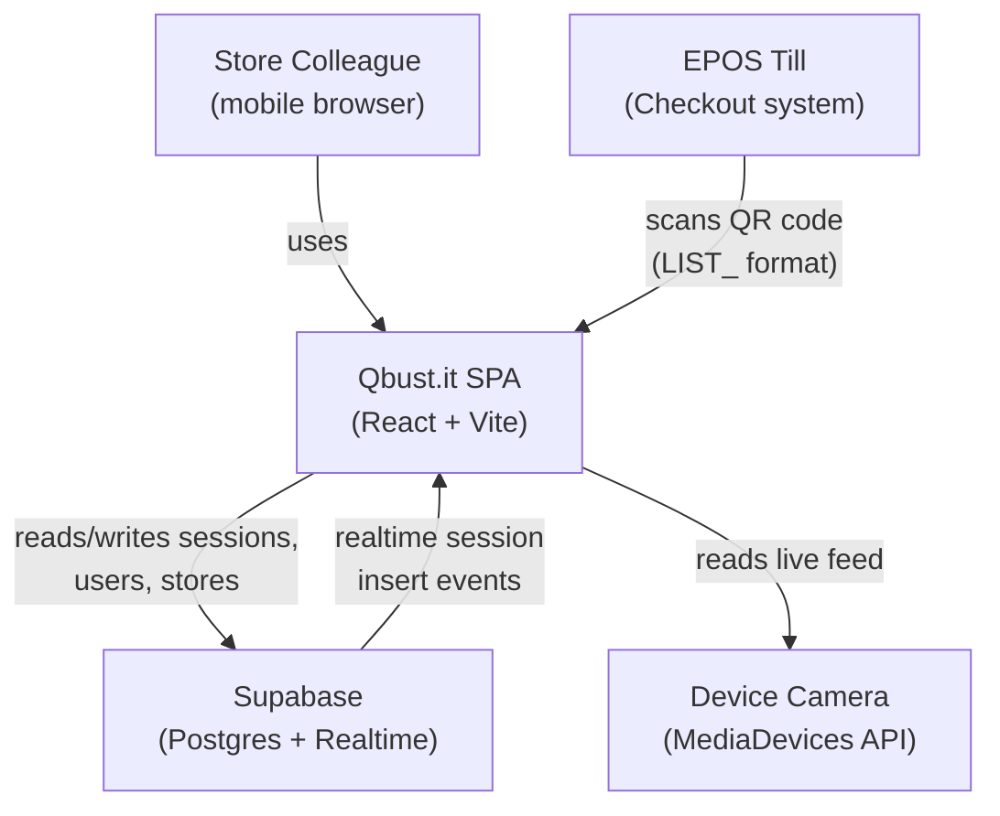
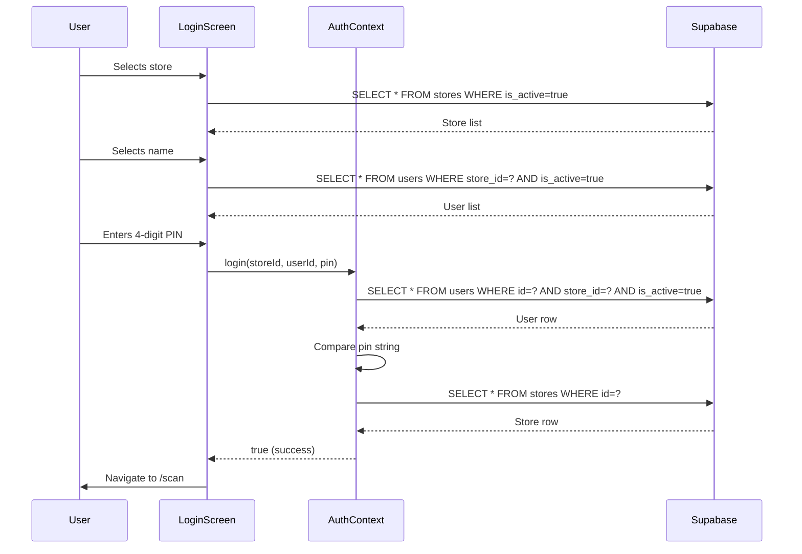
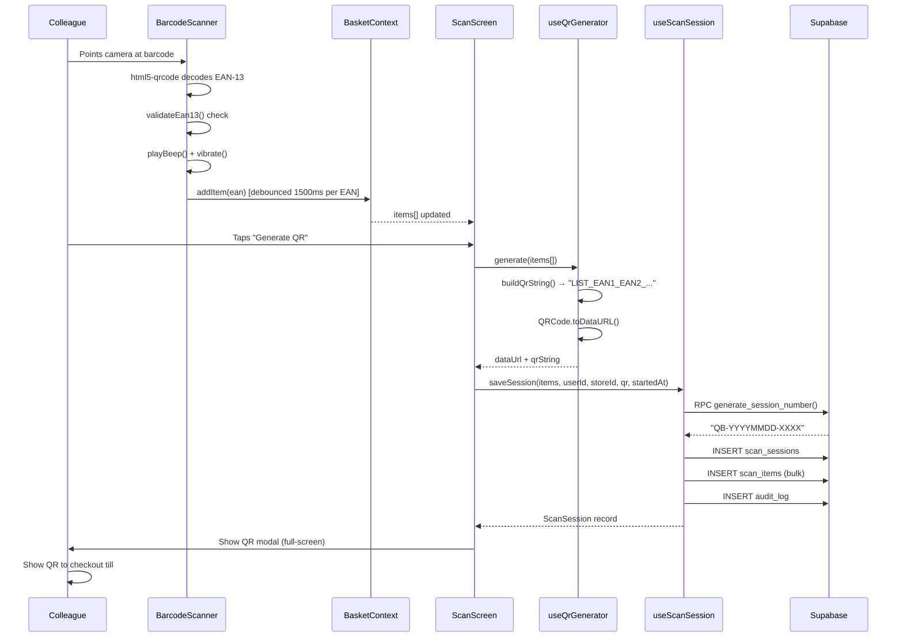
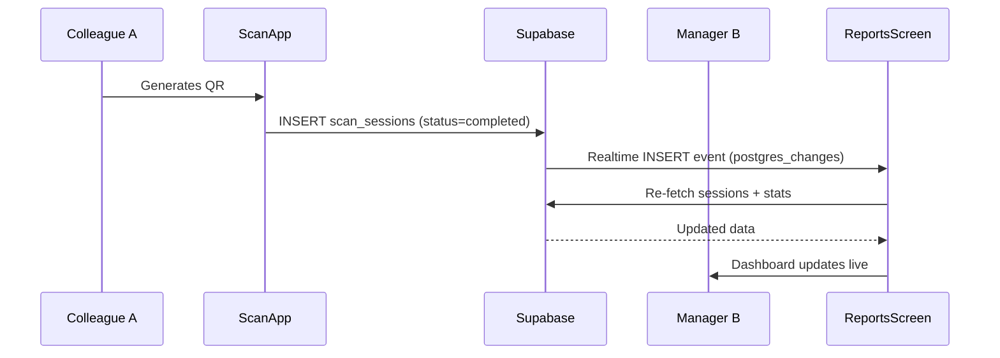

# Architecture — Primark Qbust.it POC

## System Context

Qbust.it is a mobile-first web application deployed as a static SPA (Single-Page Application). Store colleagues access it via a browser on a shared handheld device. The app uses a device camera to scan EAN-13 barcodes, builds a basket in memory, and generates a QR code that the EPOS till scans at checkout.



---

## Component Architecture

```mermaid
graph TD
    subgraph "Entry Point"
        main["main.tsx"]
        App["App.tsx\n(Router + Providers)"]
    end

    subgraph "Context (Global State)"
        AuthCtx["AuthContext\n(user, store, login, logout,\nrole helpers)"]
        BasketCtx["BasketContext\n(items[], addItem, removeItem,\nclearBasket, debounce)"]
        ToastCtx["ToastContext\n(showToast queue)"]
    end

    subgraph "Screens"
        Login["LoginScreen\n(store → user → PIN flow)"]
        Scan["ScanScreen\n(camera + basket + QR modal)"]
        Reports["ReportsScreen\n(stats, charts, sessions table)"]
        Admin["AdminScreen\n(users tab + stores tab)"]
    end

    subgraph "Scanning Components"
        BarcodeScanner["BarcodeScanner\n(camera viewfinder,\ntorch, zoom, overlay)"]
        BasketList["BasketList\n(scrollable EAN list,\nremove, generate)"]
        QrCodeDisplay["QrCodeDisplay\n(QR image + session info)"]
        ItemCountBadge["ItemCountBadge\n(floating item count)"]
    end

    subgraph "UI Components"
        StatCard["StatCard"]
        DataTable["DataTable"]
        DateRangePicker["DateRangePicker"]
        PinPad["PinPad"]
        ConfirmDialog["ConfirmDialog"]
        Toast["Toast"]
        ZoomSlider["ZoomSlider"]
    end

    subgraph "Layout Components"
        NavBar["NavBar\n(burger menu, user info, logout)"]
        PageHeader["PageHeader"]
    end

    subgraph "Hooks"
        useAuth["useAuth"]
        useBasket["useBasket"]
        useBarcodeScanner["useBarcodeScanner\n(html5-qrcode wrapper)"]
        useCamera["useCamera\n(zoom + torch via\nMediaStreamTrack)"]
        useQrGenerator["useQrGenerator\n(qrcode lib)"]
        useScanSession["useScanSession\n(Supabase writes)"]
        useReportData["useReportData\n(Supabase reads + Realtime)"]
        useUsers["useUsers\n(CRUD + active filter)"]
        useStores["useStores\n(CRUD + active filter)"]
        useAudit["useAudit\n(audit_log writes)"]
        useToast["useToast"]
    end

    subgraph "Lib"
        supabase["supabase.ts\n(Supabase client)"]
        types["types.ts\n(TypeScript interfaces)"]
        ean13["ean13.ts\n(validateEan13)"]
        qrFormat["qrFormat.ts\n(buildQrString, exceedsQrLimit)"]
        audio["audio.ts\n(Web Audio API beep)"]
        utils["utils.ts\n(formatDateTime, formatRelativeTime)"]
    end

    main --> App
    App --> AuthCtx
    App --> BasketCtx
    App --> ToastCtx
    App --> Login
    App --> Scan
    App --> Reports
    App --> Admin

    Scan --> BarcodeScanner
    Scan --> BasketList
    Scan --> ConfirmDialog

    BarcodeScanner --> useBarcodeScanner
    BarcodeScanner --> useCamera
    BarcodeScanner --> ZoomSlider
    BarcodeScanner --> ItemCountBadge

    useBarcodeScanner --> ean13
    useBarcodeScanner --> audio

    Scan --> useScanSession
    Scan --> useQrGenerator
    useQrGenerator --> qrFormat

    Reports --> useReportData
    Reports --> useUsers
    Reports --> useStores
    Reports --> StatCard
    Reports --> DataTable
    Reports --> DateRangePicker

    Admin --> useUsers
    Admin --> useStores
    Admin --> PinPad

    useScanSession --> supabase
    useScanSession --> useAudit
    useReportData --> supabase
    useUsers --> supabase
    useStores --> supabase
    useAudit --> supabase
    AuthCtx --> supabase
```



---

## Layers

| Layer | Contents | Responsibility |
|-------|----------|----------------|
| **Entry** | `main.tsx`, `App.tsx` | Bootstrap React, configure router and provider tree |
| **Screens** | `LoginScreen`, `ScanScreen`, `ReportsScreen`, `AdminScreen` | Full-page views; orchestrate hooks and components |
| **Context** | `AuthContext`, `BasketContext`, `ToastContext` | Global state shared across screens |
| **Components** | `components/scanning/*`, `components/ui/*`, `components/layout/*` | Reusable, stateless or lightly stateful UI |
| **Hooks** | `hooks/*` | Data fetching, Supabase mutations, device API interactions |
| **Lib** | `lib/*` | Pure utilities, types, and client singletons |
| **Database** | Supabase (Postgres) | Persistent storage; Realtime for live report updates |

---

## Routing

Routes are defined in `App.tsx` using React Router v6. Guards wrap protected routes.

| Path | Screen | Guard |
|------|--------|-------|
| `/login` | LoginScreen | None |
| `/scan` | ScanScreen | `RequireAuth` |
| `/reports` | ReportsScreen | `RequireAuth` + `RequireReports` (store_manager or admin) |
| `/admin` | AdminScreen | `RequireAuth` + `RequireAdmin` (admin only) |
| `*` | — | Redirects to `/login` |

---

## Authentication Flow

Authentication is entirely application-level (no Supabase Auth). On login the app queries the `users` table directly, comparing the submitted PIN string to the stored value. The authenticated user and store are held in `AuthContext` (React in-memory state). There is no token, session cookie, or local-storage persistence — a page refresh clears the session.



---

## Scanning & QR Generation Flow



---

## Realtime Data Flow (Reports)

`useReportData` subscribes to Supabase Realtime on the `scan_sessions` table. Any INSERT of a `completed` session triggers a re-fetch, so the Reports dashboard updates automatically when a colleague generates a QR code elsewhere in the store.



---

## Camera & Device Integration

The `BarcodeScanner` component integrates with two browser APIs:

| API | Hook | Purpose |
|-----|------|---------|
| `html5-qrcode` (MediaDevices) | `useBarcodeScanner` | Access rear camera, decode EAN-13 at 10fps |
| `MediaStreamTrack.applyConstraints` | `useCamera` | Programmatic zoom (Android Chrome) and torch toggle |
| Web Audio API | `audio.ts` | Synthesised 1800Hz beep on successful scan |
| `navigator.vibrate` | `useBarcodeScanner` | 80ms haptic feedback on successful scan |

> Note: Camera zoom via `MediaStreamTrack` is not supported on iOS Safari. The `useCamera` hook detects this via `getCapabilities()` and conditionally renders the zoom slider.

---

## QR Code Format

The QR payload is a plain string conforming to a Qbust.it EPOS integration contract defined in `src/lib/qrFormat.ts`:

```
LIST_5012345678901_5012345678918_5012345678925
```

- Prefix `LIST_` identifies the payload type to the EPOS system
- EAN-13 codes are joined with `_` as the delimiter
- Maximum payload: 4,296 characters (QR Version 40, error correction level M)
- This corresponds to approximately 280 items per basket

---

## Technology Stack

| Concern | Technology | Version |
|---------|------------|---------|
| UI Framework | React | 18.3 |
| Language | TypeScript | 5.4 |
| Build Tool | Vite | 5.2 |
| Styling | Tailwind CSS | 3.4 |
| Routing | React Router | 6.22 |
| Barcode Scanning | html5-qrcode | 2.3 |
| QR Generation | qrcode | 1.5 |
| Backend / DB | Supabase (Postgres) | 2.39 |
| Charts | Recharts | 2.12 |
| Date Utilities | date-fns | 3.3 |
| Icons | lucide-react | 0.344 |
| UUID Generation | uuid | 9.0 |
