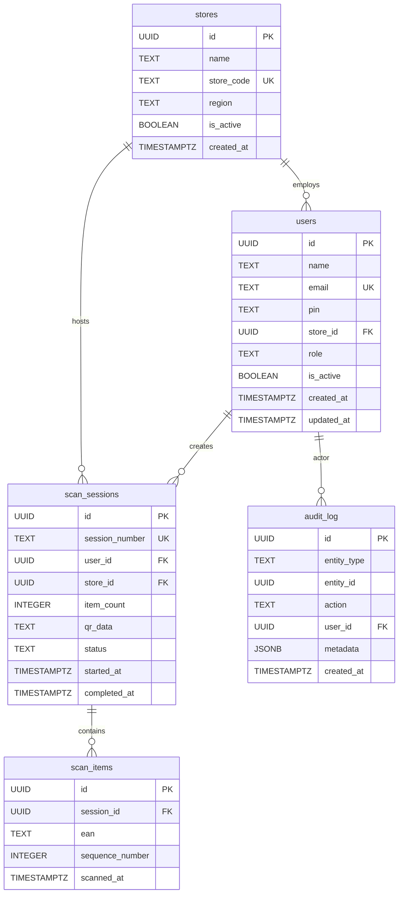

# Data Model — Primark Qbust.it POC

## Overview

The data model captures the lifecycle of a queue-busting interaction: a store colleague scans items on the shop floor, the system assembles a basket, and on QR generation the basket is persisted as a `scan_session` with its associated `scan_items`. An `audit_log` records significant actions. `stores` and `users` represent the operational configuration.

---

## Entity Relationship Diagram

---

## Table Descriptions

### `stores`

Represents a physical Primark retail location. Each store has a unique machine-readable `store_code` (e.g. `MAN01`) alongside a human-readable `name`. Stores can be deactivated without deletion (`is_active = false`).

| Column | Type | Notes |
|--------|------|-------|
| `id` | UUID | Primary key, auto-generated |
| `name` | TEXT | Display name, e.g. "Manchester Arndale" |
| `store_code` | TEXT | Unique short code, e.g. "MAN01" |
| `region` | TEXT | Optional regional grouping, e.g. "North West" |
| `is_active` | BOOLEAN | Soft-delete flag; defaults to `true` |
| `created_at` | TIMESTAMPTZ | Record creation timestamp |

---

### `users`

A Primark store colleague. Users are scoped to a single store and carry one of three roles. PIN is a 4-digit numeric string stored in plaintext (POC only — see known limitations). Authentication is application-level; there is no Supabase Auth integration.

| Column | Type | Notes |
|--------|------|-------|
| `id` | UUID | Primary key |
| `name` | TEXT | Display name, e.g. "Sarah K" |
| `email` | TEXT | Unique, used as identity for admin display |
| `pin` | TEXT | 4-digit numeric PIN, checked at login |
| `store_id` | UUID | FK → `stores.id` (NOT NULL) |
| `role` | TEXT | `floor_colleague` \| `store_manager` \| `admin` |
| `is_active` | BOOLEAN | Soft-delete; inactive users cannot log in |
| `created_at` | TIMESTAMPTZ | Record creation timestamp |
| `updated_at` | TIMESTAMPTZ | Auto-maintained by `users_updated_at` trigger |

**Role permissions matrix:**

| Capability | floor_colleague | store_manager | admin |
|------------|:-:|:-:|:-:|
| Scan items | ✓ | ✓ | ✓ |
| View reports (own store) | — | ✓ | ✓ |
| View reports (all stores) | — | — | ✓ |
| Manage users | — | — | ✓ |
| Manage stores | — | — | ✓ |

---

### `scan_sessions`

The primary business entity. Each row represents one customer basket interaction. Sessions are only written to the database at the moment of QR code generation (`status = 'completed'`) or explicit basket discard (`status = 'cancelled'`). In-progress baskets exist only in client-side React state.

| Column | Type | Notes |
|--------|------|-------|
| `id` | UUID | Primary key |
| `session_number` | TEXT | Human-readable reference, format `QB-YYYYMMDD-XXXX` (generated by `generate_session_number()` Postgres function) |
| `user_id` | UUID | FK → `users.id` |
| `store_id` | UUID | FK → `stores.id` |
| `item_count` | INTEGER | Count of scanned EANs |
| `qr_data` | TEXT | Full QR payload string (`LIST_EAN1_EAN2_...`); NULL for cancelled sessions |
| `status` | TEXT | `completed` \| `cancelled` |
| `started_at` | TIMESTAMPTZ | When the first scan in the session occurred (client-tracked) |
| `completed_at` | TIMESTAMPTZ | When the QR code was generated; NULL for cancelled sessions |

---

### `scan_items`

Individual EAN-13 scans belonging to a session. Records the sequence and timestamp of each scan. Cascade-deleted when the parent `scan_session` is deleted.

| Column | Type | Notes |
|--------|------|-------|
| `id` | UUID | Primary key |
| `session_id` | UUID | FK → `scan_sessions.id` ON DELETE CASCADE |
| `ean` | TEXT | 13-digit numeric EAN-13 barcode string |
| `sequence_number` | INTEGER | Scan order within the session (1-based) |
| `scanned_at` | TIMESTAMPTZ | Client-reported scan timestamp |

---

### `audit_log`

Immutable event log. Records significant actions against sessions, users, and stores. The `entity_type` / `entity_id` pair identifies the subject of the action.

| Column | Type | Notes |
|--------|------|-------|
| `id` | UUID | Primary key |
| `entity_type` | TEXT | `session` \| `user` \| `store` |
| `entity_id` | UUID | ID of the subject entity |
| `action` | TEXT | Action label: `completed`, `cancelled`, etc. |
| `user_id` | UUID | FK → `users.id` — the actor |
| `metadata` | JSONB | Optional structured context |
| `created_at` | TIMESTAMPTZ | Event timestamp |

---

## Database Functions & Triggers

### `generate_session_number()` — Postgres function

Produces a unique session reference in the format `QB-YYYYMMDD-XXXX`, where `XXXX` is a zero-padded sequence number sourced from the `session_daily_seq` Postgres sequence. Called via Supabase RPC from `useScanSession.ts`.

### `users_updated_at` — Trigger

`BEFORE UPDATE` trigger on `users` that sets `updated_at = now()` before each row update.

---

## Performance Indexes

| Index | Table | Columns | Purpose |
|-------|-------|---------|---------|
| `idx_sessions_store` | `scan_sessions` | `store_id, status` | Filter sessions by store + status (Reports) |
| `idx_sessions_user` | `scan_sessions` | `user_id` | Filter sessions by colleague |
| `idx_sessions_started` | `scan_sessions` | `started_at` | Date-range queries (Reports) |
| `idx_sessions_status` | `scan_sessions` | `status` | Status filter (completed/cancelled) |
| `idx_items_session` | `scan_items` | `session_id` | Bulk fetch items for a session |
| `idx_items_ean` | `scan_items` | `ean` | EAN lookup |
| `idx_audit_entity` | `audit_log` | `entity_type, entity_id` | Audit trail lookup by entity |
| `idx_users_store` | `users` | `store_id, is_active` | Active user lookup by store (Login) |

---

## Client-Side Data: `BasketItem`

Not persisted to the database until QR generation. Lives exclusively in React context (`BasketContext`).

| Field | Type | Notes |
|-------|------|-------|
| `id` | string | Client-generated UUID (React list key only) |
| `ean` | string | EAN-13 barcode string |
| `sequence` | number | Scan order (re-sequenced on removal) |
| `scannedAt` | Date | Client timestamp of scan |
