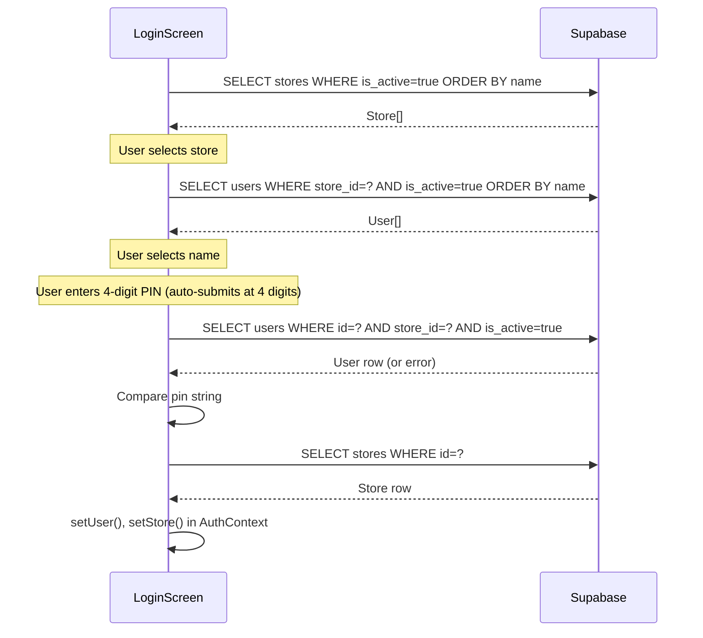
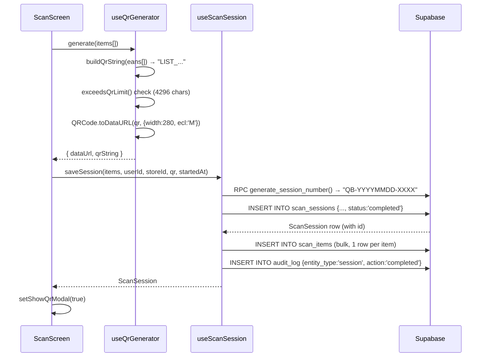
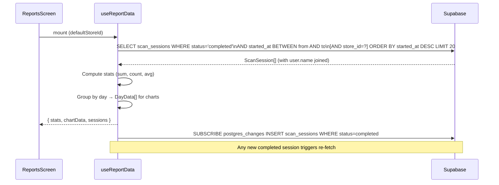

# Design Document — Primark Qbust.it POC

## Purpose

This document describes the technical design, key implementation decisions, and interaction flows of the Qbust.it POC. It is intended for engineers building on or extending this application.

---

## Tech Stack

| Concern | Technology | Rationale |
|---------|------------|-----------|
| UI Framework | React 18 + TypeScript | Component model suits multi-screen mobile app; TypeScript provides correctness across data layer |
| Build Tool | Vite 5 | Fast HMR and ESM-native builds; well-supported React integration via `@vitejs/plugin-react` |
| Styling | Tailwind CSS 3 | Utility-first, mobile-first; custom Primark brand tokens defined in `tailwind.config.js` |
| Routing | React Router 6 | Declarative routing; `<Navigate>` guards keep role enforcement co-located with routes |
| Backend / DB | Supabase | Managed Postgres with a JavaScript client; Realtime subscriptions require no additional infrastructure |
| Barcode Scanning | html5-qrcode 2.3 | Wraps MediaDevices API; supports EAN-13 format selection; tested on Android Chrome and iOS Safari |
| QR Generation | qrcode 1.5 | Client-side; `toDataURL` produces a PNG for display in `` tag with no server round-trip |
| Charts | Recharts 2 | React-native chart components; `ResponsiveContainer` handles mobile viewports cleanly |
| Date Utilities | date-fns 3 | Tree-shakeable; `format`, `parseISO` used for chart date grouping |
| Icons | lucide-react 0.344 | Consistent icon set; tree-shakeable SVG components |

---

## Project Structure

```
src/
  App.tsx                  Router, provider tree, route guards
  main.tsx                 React entry point

  screens/
    LoginScreen.tsx        3-step login (store → user → PIN)
    ScanScreen.tsx         Camera + basket + QR modal
    ReportsScreen.tsx      Analytics dashboard
    AdminScreen.tsx        User and store CRUD

  context/
    AuthContext.tsx        User/store state, login(), logout(), role helpers
    BasketContext.tsx      In-memory basket: items[], addItem(), removeItem(), clearBasket()
    ToastContext.tsx       Toast notification queue

  components/
    layout/
      NavBar.tsx           App header with burger menu; shows user/store name
      PageHeader.tsx       Screen title + subtitle bar
    scanning/
      BarcodeScanner.tsx   Camera viewfinder, torch, zoom overlay, targeting frame
      BasketList.tsx       Scrollable scanned items list with remove and generate actions
      ItemCountBadge.tsx   Floating item count shown in camera corner
      QrCodeDisplay.tsx    QR image display component (used within ScanScreen modal)
    ui/
      StatCard.tsx         Summary metric card (value + label)
      DataTable.tsx        Generic typed table with loading skeleton
      DateRangePicker.tsx  From/to date inputs
      PinPad.tsx           Reusable 4-digit PIN entry (used in Login and Admin)
      ConfirmDialog.tsx    Modal confirmation with configurable variant
      Toast.tsx            Toast notification renderer
      ZoomSlider.tsx       Horizontal range slider for camera zoom

  hooks/
    useAuth.ts             Re-export of useAuth from AuthContext
    useBasket.ts           Re-export of useBasket from BasketContext
    useBarcodeScanner.ts   html5-qrcode lifecycle management
    useCamera.ts           MediaStreamTrack zoom + torch controls
    useQrGenerator.ts      qrcode lib wrapper → dataUrl + qrString
    useScanSession.ts      Supabase writes: session + scan_items + audit_log
    useReportData.ts       Supabase reads + Realtime subscription for report data
    useUsers.ts            User CRUD + active admin guard
    useStores.ts           Store CRUD
    useAudit.ts            audit_log INSERT wrapper
    useToast.ts            Access to ToastContext

  lib/
    supabase.ts            Supabase client singleton (env var configuration)
    types.ts               All TypeScript interfaces and type aliases
    ean13.ts               validateEan13() pure function
    qrFormat.ts            buildQrString(), parseQrString(), exceedsQrLimit()
    audio.ts               Web Audio API beep + AudioContext lifecycle
    utils.ts               formatDateTime(), formatRelativeTime(), formatShortDate()

supabase/
  schema.sql               Tables, functions, triggers
  indexes.sql              Performance indexes
  seed.sql                 Test stores, users, sample sessions
```

---

## Key Design Decisions

### 1. Basket State is Client-Only Until QR Generation

In-progress baskets are never persisted to the database. Only two database writes occur: on QR generation (`status = 'completed'`) or on explicit basket discard (`status = 'cancelled'`). This avoids orphaned "in_progress" rows and simplifies the schema — there is no session status update step.

**Implementation**: `BasketContext` holds the basket array in React state. `useScanSession.saveSession()` performs the write atomically from the user's perspective (session INSERT → scan_items bulk INSERT → audit_log INSERT).

### 2. Application-Level Authentication

Supabase Auth (JWT-based) is not used. The login flow performs a direct SQL query against the `users` table and compares PINs in JavaScript. Authenticated state is held in `AuthContext` (React in-memory). No token is persisted. This is intentional for POC simplicity on shared devices, with SSO via Azure AD / Entra ID planned for Phase 3.

**Consequence**: A page refresh logs the user out. All Supabase queries use the anon key.

### 3. Role Hierarchy via Inclusive Helper Flags

Rather than comparing role strings at call sites, `AuthContext` computes boolean flags with inclusive semantics:

```ts
isFloorColleague = hasRole(role, 'floor_colleague', 'store_manager', 'admin')
isStoreManager   = hasRole(role, 'store_manager', 'admin')
isAdmin          = hasRole(role, 'admin')
```

This means an admin passes all guards, a store manager passes `isStoreManager` and `isFloorColleague` checks, etc. Route guards (`RequireReports`, `RequireAdmin`) consume these flags.

### 4. Scan Deduplication via Per-EAN Debounce

`BasketContext.addItem()` maintains a `Map<ean, lastScanTimestamp>` in a `useRef`. If the same EAN is presented within 1,500ms of its last acceptance, the scan is silently rejected (returns `false`). This prevents accidental duplicates from a scanner re-reading the same barcode in the viewfinder.

### 5. QR Format Contract

The EPOS integration contract is encapsulated in `src/lib/qrFormat.ts`:

```ts
export function buildQrString(eans: string[]): string {
  return `LIST_${eans.join('_')}`;
}
```

The `LIST_` prefix identifies the payload to the EPOS system, which splits on `_`, discards `LIST`, and processes each EAN-13. Character limit is 4,296 (QR Version 40, error correction level M), enforced before generation via `exceedsQrLimit()`.

### 6. EAN-13 Validation

All scanned codes pass through `validateEan13()` in `src/lib/ean13.ts` before being added to the basket. This implements the standard EAN-13 check-digit algorithm (alternating ×1/×3 weights on the first 12 digits). Invalid codes are rejected with an error toast.

### 7. Camera Control via MediaStreamTrack

Zoom and torch are applied via `MediaStreamTrack.applyConstraints({ advanced: [{ zoom }] })`. The `useCamera` hook calls `track.getCapabilities()` after the scanner starts to determine whether the device supports zoom. If `caps.zoom` is absent, the zoom slider is hidden and a "move closer to scan" hint is shown. A default 2× zoom is applied on devices that support it.

### 8. Realtime Report Updates

`useReportData` subscribes to the `scan_sessions` table via Supabase Realtime (postgres_changes, INSERT event, filtered to `status=eq.completed`). This allows a store manager's Reports screen to update live as colleagues generate QR codes without requiring manual refresh.

### 9. Audio via Web Audio API

No audio files are bundled. A synthesised 1800Hz square-wave oscillator is created inline using the Web Audio API for each scan beep. `AudioContext` is initialised on first user interaction (PIN digit press) to satisfy browser autoplay policies. Audio errors are swallowed — scanning works without sound.

### 10. Session Number Generation via Postgres Function

Session reference numbers (`QB-YYYYMMDD-XXXX`) are generated server-side using a Postgres function (`generate_session_number()`) backed by a sequence (`session_daily_seq`). This ensures uniqueness without client-side coordination. The function is called via Supabase RPC (`supabase.rpc('generate_session_number')`).

> Note: The sequence is global (not reset daily). The YYYYMMDD in the format reflects the date at generation time, not a per-day counter. Sequence numbers will increase monotonically across days.

---

## Supabase Client

`src/lib/supabase.ts` exports a single Supabase client instance configured from Vite environment variables:

```ts
VITE_SUPABASE_URL=https://your-project.supabase.co
VITE_SUPABASE_ANON_KEY=your-anon-key
```

All data access uses the anon key. No Row Level Security (RLS) policies are defined in the POC — access control is enforced solely at the application layer.

---

## Data Flow: Login



---

## Data Flow: QR Generation & Session Save



---

## Data Flow: Reports



---

## Admin Operations

### Create / Update User

```
useUsers.createUser(data)  → supabase.from('users').insert({...})
useUsers.updateUser(id, partial) → supabase.from('users').update({...}).eq('id', id)
```

PIN is included in create (required) and optionally in update (omitted if blank in form).

### Activate / Deactivate User

```
useUsers.setUserActive(id, boolean) → supabase.from('users').update({is_active}).eq('id', id)
```

Before deactivating an admin, `countActiveAdmins()` queries the count of `is_active=true` users with `role='admin'`. If the count is 1, deactivation is blocked with a toast.

### Create / Update Store

```
useStores.createStore(data) → supabase.from('stores').insert({...})
useStores.updateStore(id, partial) → supabase.from('stores').update({...}).eq('id', id)
```

---

## Tailwind Brand Tokens

Custom colour tokens are defined in `tailwind.config.js` and used throughout:

| Token | Hex | Usage |
|-------|-----|-------|
| `primark-blue` | `#0DAADB` | Primary actions, active states, charts |
| `navy` | `#1A1F36` | Headings, primary text |
| `charcoal` | `#3D3D3D` | Body text |
| `mid-grey` | `#6B7280` | Secondary text, labels |
| `light-grey` | `#F4F4F6` | Page backgrounds, skeleton loaders |
| `border-grey` | `#E5E7EB` | Borders, dividers |
| `success` | `#16A34A` | Success states |
| `danger` | `#DC2626` | Errors, destructive actions |
| `warning` | `#D97706` | Warnings, torch-on indicator |

---

## Environment Variables

| Variable | Required | Description |
|----------|----------|-------------|
| `VITE_SUPABASE_URL` | Yes | Supabase project URL |
| `VITE_SUPABASE_ANON_KEY` | Yes | Supabase anon (public) API key |

Variables are prefixed with `VITE_` to be exposed to the browser bundle by Vite.

---

## Build & Deployment

```bash
npm run dev        # Vite dev server (hot reload) — http://localhost:5173
npm run build      # TypeScript compile + Vite production build → dist/
npm run preview    # Preview production build locally
```

The `dist/` output is a static site suitable for deployment to any static hosting (Netlify, Vercel, AWS S3 + CloudFront, etc.).

---

## POC Limitations & Upgrade Path

| Limitation | Detail | Upgrade Path |
|------------|--------|--------------|
| Plaintext PINs | `users.pin` stored as plain string | Hash with bcrypt before production; migrate to SSO (Phase 3) |
| No Supabase Auth | Custom PIN auth; anon key used for all queries | Integrate Supabase Auth or Azure AD / Entra ID; issue JWTs per user |
| No RLS | All authenticated users can read/write all rows | Add Row Level Security policies in Supabase once auth is in place |
| No offline support | Login and session save require network | Implement service worker + IndexedDB queue for scan sessions |
| Session cleared on refresh | `AuthContext` is in-memory only | Persist auth token to `sessionStorage` or integrate proper auth |
| No product lookup | EAN codes relayed as-is to EPOS | Integrate with a product catalogue API to show item names during scanning |
| Print not implemented | `Printer` button shows informational toast | Integrate with mobile printer SDK (e.g. Zebra) in Phase 2 |
| Global sequence number | `session_daily_seq` does not reset per day | Replace with a per-day counter or use a different session ID scheme in production |
